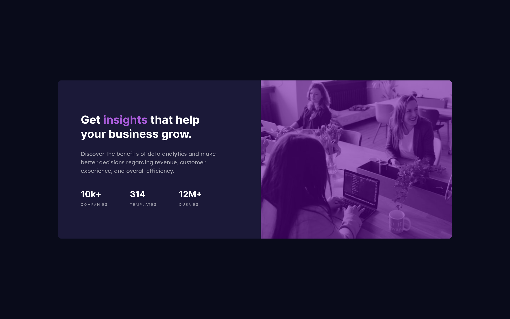

# Frontend Mentor - Stats preview card component solution

This is a solution to the [Stats preview card component challenge on Frontend Mentor](https://www.frontendmentor.io/challenges/stats-preview-card-component-8JqbgoU62).

## Table of contents

- [Overview](#overview)
  - [The challenge](#the-challenge)
  - [Screenshots](#screenshots)
  - [Links](#links)
- [My process](#my-process)
  - [Built with](#built-with)
  - [What I learned](#what-i-learned)
  - [Useful resources](#useful-resources)
- [Author](#author)
- [Acknowledgments](#acknowledgments)
- [Copyright](#copyright)

<hr />

## Overview

### The challenge

Users should be able to:

- View the optimal layout depending on their device's screen size.

### Screenshots

<div align="center">
  
  
</div>

### Links

<!-- - Solution URL: [Add solution URL here](https://your-solution-url.com)
- Live Site URL: [Add live site URL here](https://your-live-site-url.com) -->

<hr />

## My process

### Built with

- Semantic HTML5 markup
- SASS (SCSS syntax), variables, partials, mixins
- Flexbox layout
- Mobile-first workflow
- [Dart SASS](https://github.com/sass/dart-sass), [Autoprefixer](https://github.com/postcss/autoprefixer), [PostCSS](https://github.com/postcss/postcss), [PurgeCSS](https://github.com/FullHuman/purgecss)

### What I learned

Optimized image rendering...

```html
<picture>
  <source srcset="big-img-url.jpg" media="(min-width: breakpoint)" />
  
</picture>
```

...and a nice opportunity to use the `:not` pseudo-class

```css
.my-class {
  &:not(:last-child) {
    selector: value;
  }
}
```

### Useful resources

- [CSS Tricks - A guide to the responsive images syntax in HTML](https://css-tricks.com/a-guide-to-the-responsive-images-syntax-in-html/) - An awesome article that I used to learn how to manage responsive images.

<hr />

## Author

- Github - [evfjunior](https://github.com/evfjunior)
- Frontend Mentor - [@evfjunior](https://www.frontendmentor.io/profile/evfjunior)

<hr />

## Acknowledgments

A huge thanks to [Frontend Mentor](https://www.frontendmentor.io) for helping us developers to improve our skills with so great layouts and page designs!

<hr />

## Copyright

&copy; 2021 - [evfjunior](https://github.com/evfjunior), [MIT](LICENSE)
